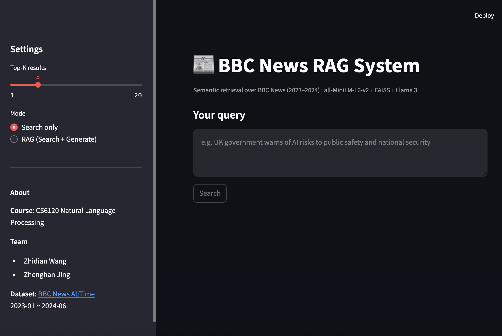
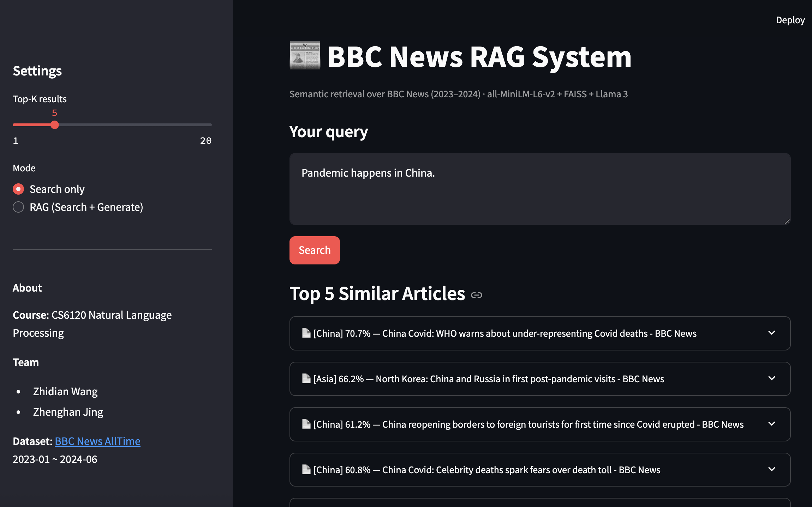
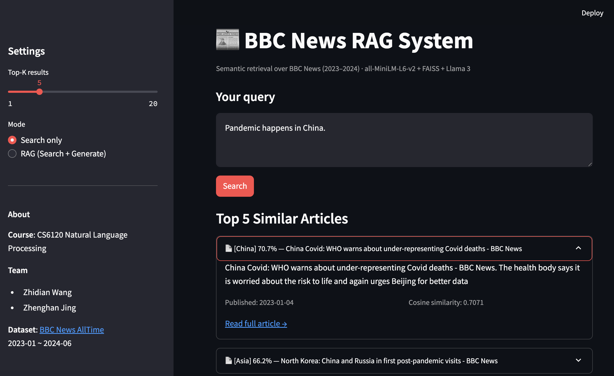
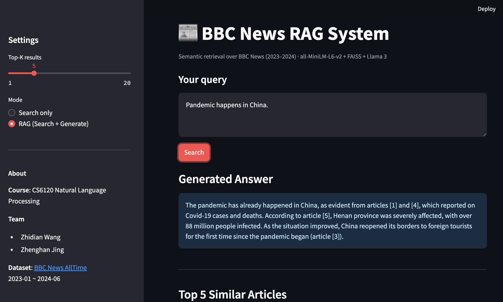

# News RAG — BBC News Retrieval & Generation

**CS6120 Natural Language Processing**  
Zhidian Wang · Zhenghan Jing

A fully local Retrieval-Augmented Generation (RAG) system built on 18 months of BBC News articles (2023-01 to 2024-06). Given a query or news snippet, the system retrieves semantically similar articles and optionally generates a concise answer using a local LLM.

---

## Demo

### Search Interface


*Main search page — enter a query and retrieve the top-K most similar BBC News articles*

### Search Results





*Retrieved articles with cosine similarity scores, section tags, publish dates, and source links*

### RAG Generated Answer


*RAG mode — the system generates a 2-3 sentence answer grounded in the retrieved articles*

---

## Architecture

```
Query
  │
  ▼
Sentence Transformer          FAISS Index
(all-MiniLM-L6-v2)    ──►   (cosine similarity)
  │                                │
  │                         Top-K articles
  │                                │
  └──────────► Ollama (llama3) ◄──┘
                      │
                      ▼
               Generated Answer
```

| Component | Technology |
|-----------|------------|
| Embedding model | `sentence-transformers/all-MiniLM-L6-v2` |
| Vector index | FAISS (`IndexFlatIP`, cosine similarity) |
| Dataset | `RealTimeData/bbc_news_alltime` (2023-01 ~ 2024-06) |
| Backend | FastAPI |
| Frontend | Streamlit |
| LLM (optional) | Ollama + llama3 |

---

## Project Structure

```
.
├── backend/
│   └── main.py          # FastAPI server (search + RAG endpoints)
├── frontend/
│   └── app.py           # Streamlit UI
├── scripts/
│   └── build_index.py   # Build FAISS index from BBC News dataset
├── indexes/
│   ├── faiss.index      # FAISS vector index (generated)
│   └── metadata.json    # Article metadata (generated)
├── Dockerfile.backend
├── Dockerfile.frontend
└── requirements.txt
```

---

## Quickstart (Local)

### 1. Create environment and install dependencies

```bash
python3 -m venv .venv
source .venv/bin/activate
pip install -r requirements.txt
```

### 2. Build the FAISS index

Downloads 18 months of BBC News from Hugging Face and encodes all articles (~5-15 min):

```bash
python scripts/build_index.py
```

Output: `indexes/faiss.index` and `indexes/metadata.json`

### 3. Start the backend

```bash
uvicorn backend.main:app --reload
# Running at http://localhost:8000
```

### 4. Start the frontend

```bash
streamlit run frontend/app.py
# Running at http://localhost:8501
```

### 5. (Optional) Enable RAG mode with Ollama

```bash
ollama pull llama3
ollama serve
```

Then select **RAG (Search + Generate)** in the sidebar.

---

## API Endpoints

| Method | Endpoint | Description |
|--------|----------|-------------|
| `GET` | `/health` | Liveness check, returns index size |
| `POST` | `/search` | Retrieve top-K similar articles |
| `POST` | `/rag` | Retrieve + generate answer via LLM |

**Example request:**

```bash
curl -X POST http://localhost:8000/search \
  -H "Content-Type: application/json" \
  -d '{"query": "UK government announces new AI safety regulations ahead of global summit", "top_k": 5}'
```

---

## Docker

### Build images

```bash
docker build -f Dockerfile.backend -t rag-backend .
docker build -f Dockerfile.frontend -t rag-frontend .
```

### Run locally with Docker

```bash
docker run -p 8000:8000 rag-backend
docker run -p 8080:8080 -e API_URL=http://localhost:8000 rag-frontend
```

---

## Deploy to GCP Cloud Run

```bash
export PROJECT_ID=your-gcp-project-id
export REGION=us-central1

# Authenticate and configure Docker
gcloud auth login
gcloud config set project $PROJECT_ID
gcloud auth configure-docker ${REGION}-docker.pkg.dev

# Create Artifact Registry repo (once)
gcloud artifacts repositories create rag-news \
  --repository-format=docker --location=$REGION

# Build and push
docker build -f Dockerfile.backend \
  -t ${REGION}-docker.pkg.dev/${PROJECT_ID}/rag-news/backend:latest .
docker push ${REGION}-docker.pkg.dev/${PROJECT_ID}/rag-news/backend:latest

docker build -f Dockerfile.frontend \
  -t ${REGION}-docker.pkg.dev/${PROJECT_ID}/rag-news/frontend:latest .
docker push ${REGION}-docker.pkg.dev/${PROJECT_ID}/rag-news/frontend:latest

# Deploy backend
gcloud run deploy rag-backend \
  --image=${REGION}-docker.pkg.dev/${PROJECT_ID}/rag-news/backend:latest \
  --region=$REGION --memory=2Gi --cpu=2 --allow-unauthenticated

# Deploy frontend (point to backend URL)
BACKEND_URL=$(gcloud run services describe rag-backend \
  --region=$REGION --format='value(status.url)')

gcloud run deploy rag-frontend \
  --image=${REGION}-docker.pkg.dev/${PROJECT_ID}/rag-news/frontend:latest \
  --region=$REGION --memory=512Mi \
  --set-env-vars="API_URL=${BACKEND_URL}" \
  --allow-unauthenticated
```

---

## Dataset

- **Source**: [RealTimeData/bbc_news_alltime](https://huggingface.co/datasets/RealTimeData/bbc_news_alltime) on Hugging Face
- **Coverage**: January 2023 – June 2024 (18 months)
- **Fields used**: `title`, `description`, `section`, `published_date`, `link`
- **Index text**: `"{title}. {description}"` encoded with all-MiniLM-L6-v2

---

## Requirements

- Python 3.11+
- See `requirements.txt` for full dependency list
- (Optional) [Ollama](https://ollama.ai) with `llama3` for RAG generation mode
